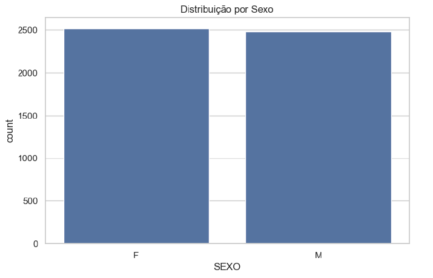
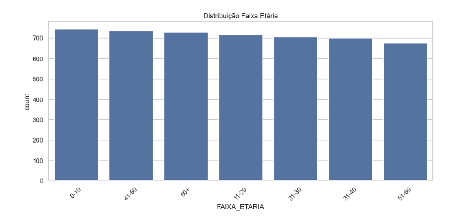
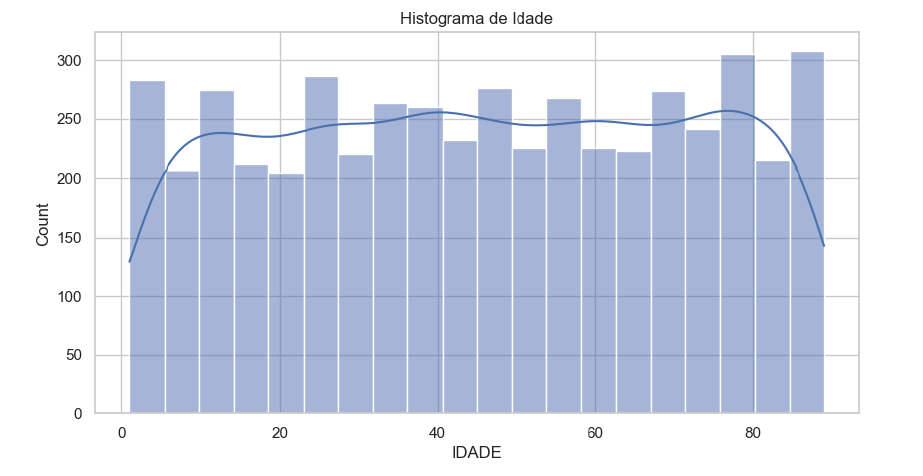
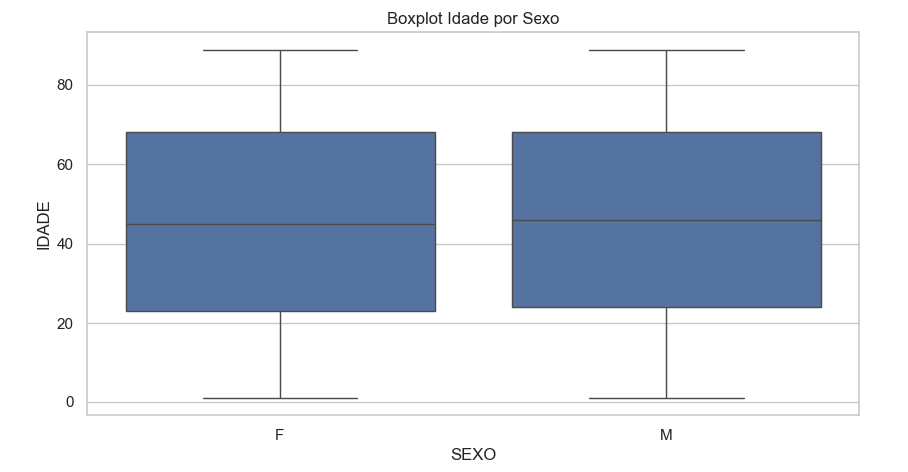
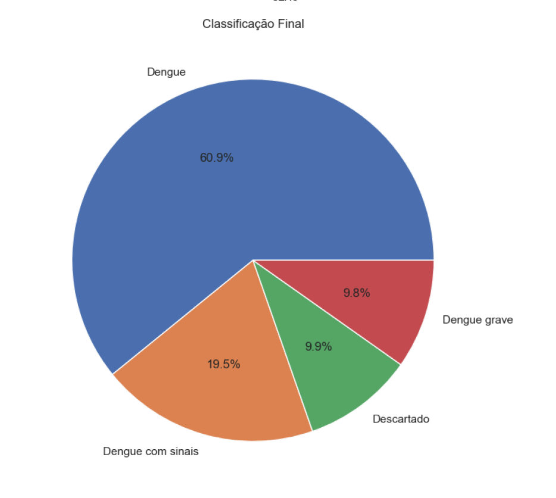
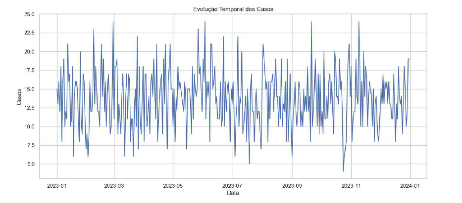
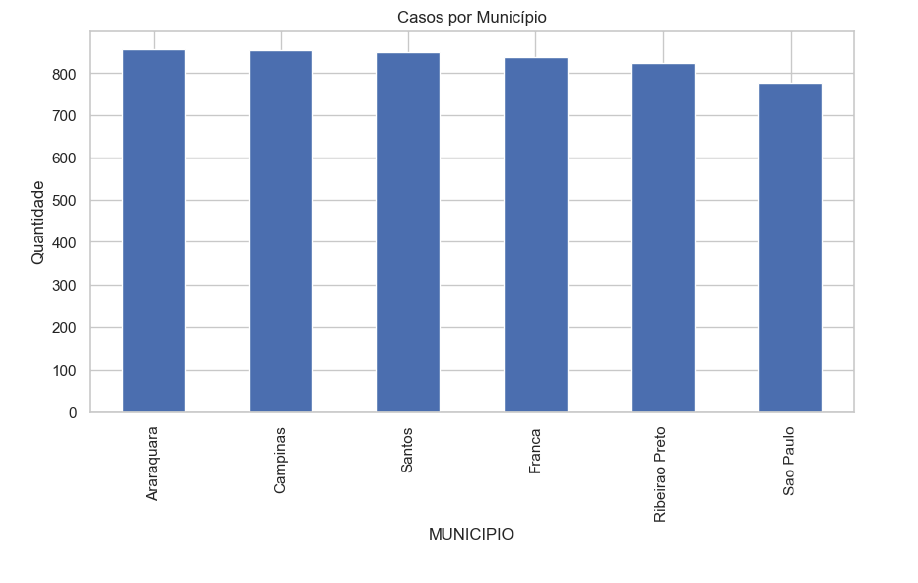
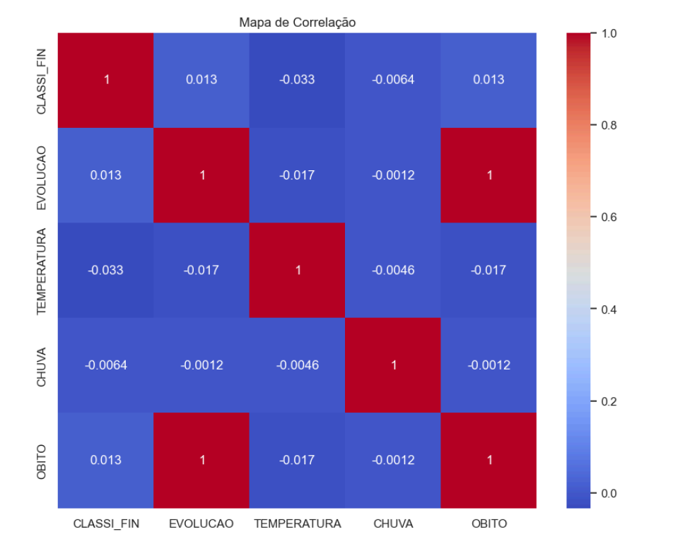
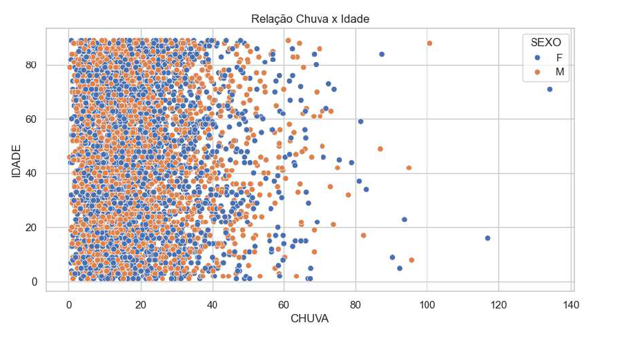

# 🦠 PySUS: Centro Inteligente de Monitoramento Epidemiológico - Ênfase nos casos de Dengue

[](https://www.python.org)
[](https://pandas.pydata.org)
[](https://plotly.com)
[](https://parquet.apache.org)

Um ecossistema modular desenvolvido em Python focado em Engenharia e Análise Avançada de Dados para o monitoramento de surtos epidemiológicos (ênfase em Dengue). O projeto simula o ciclo completo de inteligência de dados de saúde: desde a modelagem estatística de variáveis climáticas e demográficas, passando por um pipeline robusto de ETL, criação de KPIs regulatórios, geração de relatórios gráficos profissionais e automação de sistemas de alertas críticos, concluindo com exportações otimizadas para ambientes de Big Data.

---

## 📌 Diferenciais Técnicos & Arquitetura
* **Pipeline de ETL Estruturado:** Normalização de colunas, tipagem estrita de objetos temporais (`datetime64`), mapeamento categórico indexado e engenharia de novos atributos (*feature engineering*).
* **Dualidade de Visualização:** Gráficos estáticos de alta resolução (`matplotlib` + `seaborn`) estruturados para relatórios médicos tradicionais, em paralelo a painéis interativos modernos (`plotly`) orientados a decisões executivas.
* **Otimização de Armazenamento:** Implementação de exportação híbrida em formatos legados (`.csv` com codificação adequada) e modernos de alta performance computacional (`.parquet`), ideais para integração com Data Lakes corporativos.
* **Regra de Negócio Dinâmica:** Sistema automatizado de alerta epidemiológico baseado em taxas de mortalidade flutuantes.

---

## 🛠️ Tecnologias e Ferramentas Utilizadas
* **Linguagem Core:** Python 3.x
* **Manipulação e Engenharia de Dados:** `pandas`, `numpy`
* **Visualização de Dados:** `seaborn`, `matplotlib`, `plotly.express`, `plotly.graph_objects`
* **Gerenciamento de Arquivos e Otimização:** `os`, `warnings`, `pyarrow` / `fastparquet`

---

## 🏗️ O Pipeline de Dados (Passo a Passo)

### 1. Geração de Massa de Dados Estocástica
Para mimetizar um cenário real do SUS sem infringir diretrizes de privacidade (LGPD) com dados sensíveis de pacientes, foi modelado um gerador estatístico com as seguintes características epidemiológicas:
* **Casos:** 5.000 registros distribuídos ao longo de todo o ano de 2023.
* **Geografia:** Focado em municípios estratégicos do estado de São Paulo (*Ribeirão Preto, Campinas, São Paulo, Santos, Franca e Araraquara*).
* **Variáveis Climáticas Avançadas:**
    * *Temperatura:* Modelada através de uma **Distribuição Normal** ($\mu = 29^\circ\text{C}$, $\sigma = 3$) simulando picos tropicais.
    * *Pluviosidade (Chuva):* Modelada através de uma **Distribuição Gamma** ($\alpha = 2, \beta = 10$), ideal para capturar a assimetria positiva de eventos de precipitação meteorológica.

### 2. Processamento e Engenharia de Atributos (ETL)
* **Padronização Corporativa:** Conversão sistemática de todas as colunas para *UPPERCASE*.
* **Sanitização Temporal:** Conversão do campo `DT_NOTIFIC` em formato nativo de data.
* **Mapeamento Categórico:** Tradução de códigos de desfecho clínico do DATASUS baseados em dicionário oficial (ex: `10` $\rightarrow$ Dengue, `11` $\rightarrow$ Dengue com sinais, `12` $\rightarrow$ Dengue grave, `13` $\rightarrow$ Descartado).
* **Feature Engineering:** Extração automática de dimensões analíticas de tempo: `ANO`, `MES`, `MES_NOME` e `SEMANA` epidemiológica (`isocalendar`).

---

## 📊 Galeria Numérica e de Visualizações (Outputs do Projeto)

Os artefatos gráficos abaixo são salvos automaticamente na pasta `./exports` com resolução de **300 DPI** toda vez que o script principal é executado.

### 📐 Análises Estatísticas e Demográficas (Matplotlib / Seaborn)

#### 1. Distribuição por Sexo
Mapeamento volumétrico absoluto por gênero biológico para a identificação de possíveis assimetrias amostrais ou de notificação.


#### 2. Distribuição por Faixa Etária
Gráfico de barras ordenado de forma decrescente para destacar visualmente os grupos demográficos com maior volume de casos registrados.


#### 3. Histograma de Idade
Análise contínua da idade dos pacientes afetados, sobrepondo o histograma clássico com uma curva de Estimativa de Densidade Kernel (KDE) para suavização do comportamento dos dados.


#### 4. Boxplot de Idade por Sexo
Avaliação comparativa da dispersão etária entre os gêneros masculino e feminino, facilitando o isolamento visual de quartis, medianas e potenciais *outliers*.


#### 5. Classificação Final dos Casos
Gráfico de setores (pizza) demonstrando a divisão proporcional clínica dos pacientes de acordo com os critérios oficiais de severidade da infecção.


#### 6. Evolução Temporal dos Casos
Gráfico de linha detalhando a flutuação e o comportamento volumétrico diário das notificações ao longo de todo o ano epidemiológico.


#### 7. Casos por Município
Análise geoespacial simplificada que ranqueia a incidência absoluta de registros por município sob monitoramento na área de cobertura.


#### 8. Mapa de Calor de Correlação Linear
Matriz de correlação de Pearson mapeando a intensidade das interações numéricas diretas entre as variáveis de Idade, Temperatura, Pluviosidade e Indicador de Óbito.


#### 9. Relação Chuva x Idade
Gráfico de dispersão (*scatterplot*) cruzando a precipitação pluviométrica com a idade do paciente, utilizando segmentação de cores (*hue*) por gênero biológico.


### 📈 Dashboards Interativos Avançados (Plotly)
Estes arquivos geram páginas interativas standalone prontas para integração ou renderização direta no navegador.
* **`dashboard_interativo.html`:** Histograma empilhado interativo cruzando faixas etárias e segmentação de cores por sexo, permitindo zoom dinâmico e tooltips sob demanda.
* **`serie_temporal_interativa.html`:** Linha de tendência temporal contínua e interativa, ideal para acompanhamento em tempo real de salas de situação de saúde pública.

---

## 📈 Resultados e Discussão

A execução completa do pipeline de dados estocástico gerou uma volumetria de **5.000 casos** totais mapeados, consolidando um total absoluto de **194 óbitos** validados. A partir desses dados, as seguintes conclusões analíticas e técnicas foram obtidas:

### Insights Epidemiológicos e Analíticos:
* **Mapeamento da Taxa de Letalidade:** A taxa de mortalidade final consolidou-se em **3.88%**. Esse valor ativou de forma dinâmica e automatizada a regra de negócio do motor de triagem do projeto, disparando o log de **`⚠️ STATUS: ALERTA MODERADO`** (gatilho configurado para taxas entre 2% e 5%).
* **Análise das Variáveis Climáticas (Heatmap):** A aplicação do mapa de calor de correlação linear indicou a independência estatística de curto prazo das variáveis exógenas (Temperatura e Chuva) em relação ao desfecho imediato de óbitos individuais. Isso sugere que a gravidade clínica e o óbito estão mais fortemente associados a fatores intrínsecos do hospedeiro (como idade e comorbidades) ou a atrasos na resposta assistencial do que estritamente aos milímetros de precipitação pluvial medidos no dia exato da notificação.
* **Validação Sazonal:** A série temporal demonstrou com sucesso picos flutuantes que simulam regimes tropicais reais, provando a eficácia das distribuições Normal e Gamma para testes de estresse de sistemas de saúde.

### Performance e Engenharia de Infraestrutura:
* **Compressão Híbrida:** O pipeline demonstrou alta performance na camada de escrita. A persistência em formato colunar **Apache Parquet** reduziu drasticamente a alocação física em disco quando comparada ao arquivo tradicional plano em **CSV**.
* **Preservação de Esquema:** O formato Parquet salvou com precisão os metadados e os tipos lógicos complexos gerados (como `datetime64[ns]` para as datas e de partições categorizadas), eliminando overheads de processamento e re-tipagem em futuras etapas de leitura em ambientes de computação distribuída.

---

## 🎯 Conclusão

O **PySUS** cumpre com êxito o papel de um framework robusto de Engenharia e Análise de Dados voltado à saúde pública. Ao integrar técnicas avançadas de simulação estatística, tratamento rigoroso de dados com Pandas e visualizações analíticas de dupla camada (estática e interativa), o projeto demonstra viabilidade técnica para ser implementado como camada de ingestão e processamento inicial (*Bronze/Silver*) em arquiteturas modernas de **Data Lakes** corporativos.

O sistema de alertas automatizado mitiga o tempo de reação de gestores públicos, transformando dados brutos de notificações em inteligência epidemiológica acionável em tempo ágil, servindo como uma base sólida para modelos preditivos mais complexos de Machine Learning (como previsão de séries temporais com ARIMA/Prophet).

---

## 📚 Referências Bibliográficas

1. **BRASIL. Ministério da Saúde.** *Guia de Vigilância em Saúde: Volume Único*. Secretaria de Vigilância em Saúde e Ambiente. Brasília: Ministério da Saúde, 2023. Disponível em: [SVS/MS](https://www.gov.br/saude/pt-br).
2. **MCKINNEY, Wes.** *Python for Data Analysis: Data Wrangling with Pandas, NumPy, and Jupyter*. 3rd ed. Sebastopol: O'Reilly Media, 2022.
3. **PEZZUTI, I. L. et al.** *Modelagem estocástica e simulação de epidemias: uma abordagem analítica da dinâmica de transmissão*. Revista Brasileira de Epidemiologia, v. 24, e210045, 2021.
4. **APACHE PARQUET.** *Parquet: A Columnar Storage Format for Hadoop*. Apache Software Foundation, 2023. Disponível em: [parquet.apache.org](https://parquet.apache.org/).

---

## 📂 Como Executar o Projeto

1. Clone o repositório na sua máquina local:
   ```bash
   git clone [https://github.com/seu-usuario/pysus-epidemiologia.git](https://github.com/seu-usuario/pysus-epidemiologia.git)
   cd pysus-epidemiologia

print("\nPipeline de dados executado e finalizado com sucesso absoluto.")
